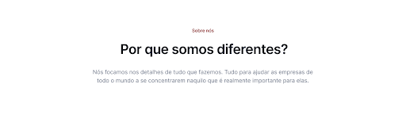
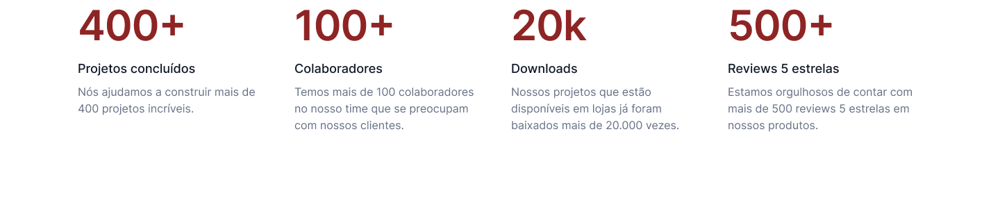
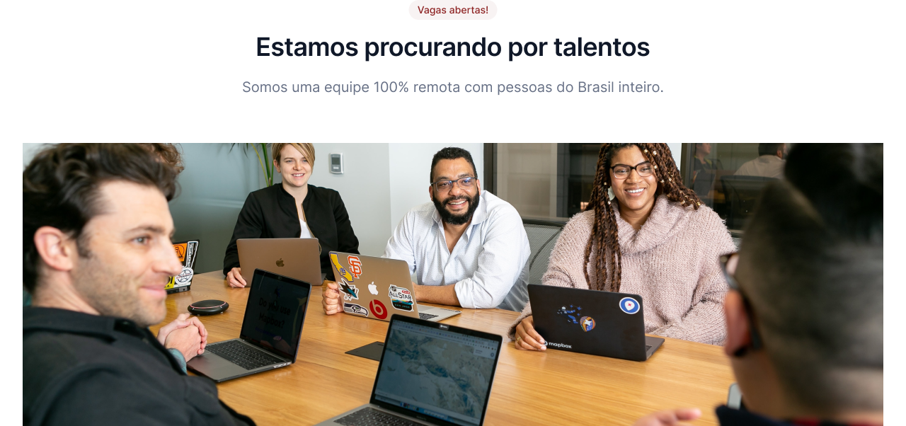
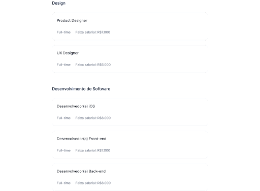

# 7DaysOfCode: 👩🏽‍💻 

### Evento alura #7DaysOfCode  recomendado após a conclusão da formação HTML e CSS para colocar  o aprendizado em prática!.

**O projeto:** Uma empresa de TI quer desenvolver uma página destinada a novas contratações e contratou você para desenvolvê-la.

### Dia 1  

Neste primeiro dia, você vai desenvolver o cabeçalho da aplicação, chamado normalmente de Navbar, que contempla o logo, o menu com as páginas e também os dois botões do canto direito, como aqui abaixo:  

### Dia 2  

O desafio de hoje é desenvolver a primeira seção da sua página, que também pode ser chamada de "cabeçalho":  

  

### Dia 2  

Hoje você vai desenvolver uma parte bem legal e desafiadora: a seção de métricas e resultados da sua página. Ela é uma seção muito comum na maioria das landing pages que vemos por aí hoje em dia.  

A empresa que te contratou pediu para você incluir 4 métricas diferentes, com um título, um subtítulo e um texto:  

  

### Dia 3  

O que você vai fazer hoje é a seção de "Estamos procurando por talentos", mas sem a parte de divulgação de vagas ainda, apenas até a imagem!  

  

### Dia 5  

Dando continuidade, hoje você vai desenvolver a parte talvez mais importante do projeto inteiro, a seção de vagas!  

  

